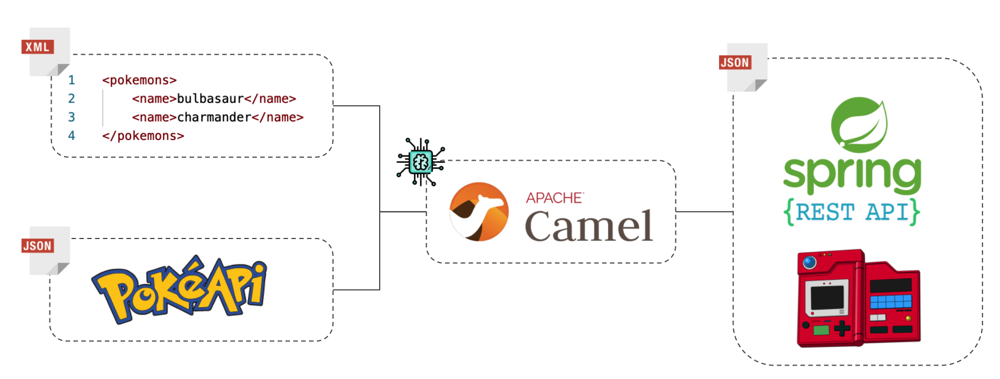

# Intro to Systems Integration Using Apache Camel

The application aims to use Apache Camel to read an XML file and, for each Pokémon name found, search for its information in the PokeAPI. Finally, the queried data in the PokéAPI will be recorded in a Pokedex simulation API that provides an integration interface via REST API.

[Forked from here](https://github.com/jntpablo/introducao-apache-camel)